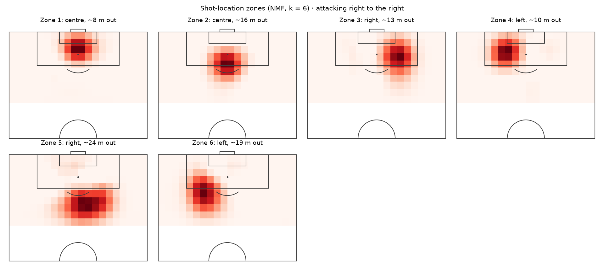

# scout

Find attacking players with a similar style across Europe's top 5 leagues, from current-season [Understat](https://understat.com) data.



*The six shot-location zones learned from all attackers' shots; each player's profile includes how their shots split across them.*

**Status:** early development. Ingestion, parsing, features, evaluation and similarity search work; the pipeline is not yet scheduled.

## Example

```
$ python -m scout.similar "Saka"
Profile: recent form, league matches 2025-11-08 to 2026-09-19 (newest 2000 minutes; each player's window below).
                 player                    teams      league position  minutes       window  age  value €m contract  npxG/90  similarity
1          Lamine Yamal                Barcelona     La_liga      AMR     2067  25-12–26-09   19     200.0  2031-06     0.52       0.815
2         Mohamed Salah                Liverpool         EPL      AMR     2073  25-08–26-05   34      22.0        –     0.34       0.814
3   Francisco Conceição                 Juventus     Serie_A      AMC     2010  25-11–26-09   23      30.0  2030-06     0.42       0.810
4                Antony               Real Betis     La_liga      AMR     2003  26-01–26-09   26      40.0  2030-06     0.34       0.778
5       Ousmane Dembélé      Paris Saint Germain     Ligue_1       FW     1222  25-08–26-09   29     100.0  2028-06     0.45       0.739
6         Michael Olise            Bayern Munich  Bundesliga      AMR     2055  25-10–26-09   24     150.0  2029-06     0.43       0.739
7    Franco Mastantuono  Real Madrid, Fiorentina     La_liga      FWR     1411  25-08–26-09   18      45.0  2031-06     0.32       0.737
8          Nicolas Pepe               Villarreal     La_liga       MR     2084  25-11–26-09   31       6.0  2028-06     0.19       0.733
9       Florian Thauvin                     Lens     Ligue_1      AMC     2017  25-11–26-09   33       5.0  2028-06     0.35       0.720
10         Paulo Dybala                     Roma     Serie_A      AMC     1773  25-08–26-09   32       5.0        –     0.38       0.716
```

By default profiles use each player's recent form: their newest 2,000 league minutes, across seasons (`window` shows the dates, as year-month). Use `--season 2025` for one season. Market filters are applied after ranking, so the result is the most similar players who meet them:

```
$ python -m scout.similar "Saka" --max-age 24 --max-value 40 --contract-before 2028
Filters (age <= 24, value <= EUR 40m, contract ends before 2028) removed 513 of 521 players; 8 remain.

               player                         teams      league position  minutes       window  age  value €m contract  npxG/90  similarity
1  Matteo Cancellieri                         Lazio     Serie_A      FWR     2040  25-08–26-09   24       7.0  2027-06     0.26       0.388
2      Haissem Hassan                   Real Oviedo     La_liga      AMR     1924  25-08–26-05   24       3.5  2027-06     0.09       0.289
3       Karim Adeyemi  Borussia Dortmund, Barcelona  Bundesliga      AMC     1440  25-08–26-09   24      40.0  2027-06     0.59       0.281
4      Anssumane Fati                        Monaco     Ligue_1      AMC     1058  25-09–26-05   23      15.0  2026-06     0.70       0.257
5    Tommaso Baldanzi                   Genoa, Roma     Serie_A      AMC     1123  25-09–26-09   23       8.5  2027-06     0.21       0.208
6      Carlos Álvarez                       Levante     La_liga       MR     1961  25-08–26-08   22      15.0  2027-06     0.12       0.083
7         Pablo Pagis             Lorient, Paris FC     Ligue_1      AMC     2059  25-10–26-09   23      15.0  2027-06     0.26       0.014
8         Tom Louchet                          Nice     Ligue_1      AML     1344  25-08–26-05   23       7.0  2027-06     0.21      -0.040

Market data: Transfermarkt snapshot as of 2026-06-12 (transfermarkt-datasets, CC0).
```

Similarity compares style, not output level, so npxG per 90 is shown next to it. Few young, affordable players share Saka's style: similarity drops quickly once the filters apply.

## How it works

**Data:** EPL, La Liga, Bundesliga, Serie A and Ligue 1: the full 2025/26 season (1,752 matches) and 2026/27 so far (250 matches to 2026-09-20), about 51k shots.

**Pipeline:**
1. `scout.ingest` downloads league and match data from Understat and caches it.
2. `scout.parse` builds shot and appearance tables and runs validation checks. If any check fails, nothing is written.
3. `scout.features` builds profiles for attackers with at least 5 starts and 900 minutes: one per player-season (493 players in 2025/26), or, with `--mode recent`, one per player from their newest 2,000 league minutes across seasons (522 players). Position is the one with the most minutes in starts within the profile's matches.
4. `scout.evaluate` measures how well the profiles identify players (see below).

**Features** (z-scored, compared by cosine similarity):
- **Per-90 rates:** non-penalty xG, shots, xA, key passes, xGChain and xGBuildup, plus npxG per shot and xGBuildup's share of xGChain.
- **Chance-creation style shares:** how a player's shots split by the action before the shot (pass, cross, take-on, rebound, …) and by body part.
- **Shot zones:** a smoothed heatmap of each player's shot locations, reduced to weights on six zones with non-negative matrix factorisation (NMF), following Decroos et al., "Player Vectors". Flanks are not mirrored, because the side a player shoots from is part of their style.

Shot-based features leave out own goals, penalties and direct free kicks.

## Evaluation

There are no labels for "similar players", so the benchmark tests self-retrieval instead. Each player's matches are split at random into two halves, and a profile is built from each half. A good profile should rank a player's own other half among the most similar of all 493.

Results over 20 random splits (mean ± std):

| features | recall@1 | recall@5 | recall@10 | MRR |
|---|---|---|---|---|
| random guess | 0.002 | 0.010 | 0.020 | 0.014 |
| npxG per 90 only | 0.004 ± 0.004 | 0.020 ± 0.005 | 0.043 ± 0.007 | 0.024 ± 0.004 |
| rates + style shares | 0.042 ± 0.008 | 0.132 ± 0.011 | 0.205 ± 0.015 | 0.099 ± 0.007 |
| **all features (+ shot zones)** | **0.059 ± 0.009** | **0.178 ± 0.012** | **0.258 ± 0.011** | **0.128 ± 0.008** |

- **Shot zones** improve recall@10 on all 20 splits when compared split by split on the same splits.
- **The number of zones** (k = 6) was tuned on this same benchmark, so that result is slightly optimistic.
- **Recent-form profiles** score about the same: recall@10 0.249 ± 0.018 on their own pool of 522 (random 0.019), splitting each player's 2,000-minute window in half.
- **Full log:** [reports/experiments.md](reports/experiments.md) has every experiment, including the rejected ones (stratified splits, Euclidean distance, shrinking style shares).

## Market data

Age, market value and contract end come from [transfermarkt-datasets](https://github.com/dcaribou/transfermarkt-datasets) (CC0). Its updates stopped in July 2026, so this is a fixed snapshot with valuations as of 2026-06-12. `python -m scout.market` downloads it once and links players:

- **Clubs** are mapped by name within each league (`data_mappings/clubs.csv`).
- **Clubs promoted for 2026/27** are found through domestic-cup games and the snapshot's club list. A club missing from the snapshot is left unmapped (currently Le Mans).
- **Players** are matched by name among the Transfermarkt players who played 2025/26 games for the mapped club, or were registered there at the snapshot. Six players known by different names in the two sources are matched by hand in `data_mappings/player_overrides.csv`.
- **Every pair is checked** against both sources' 2025/26 league goals and minutes, and flagged if goals differ by more than 1 or minutes by more than 15%. All 525 players in either pool are matched; none are flagged. Players new to these leagues in 2026/27 can't be checked this way; none are in the pool yet.
- **Hand check:** a fixed random sample of 50 pairs ([reports/match_sample.md](reports/match_sample.md), ids in `data_mappings/sample_ids.csv`) is checked by hand. Precision: TODO.

## Limitations

- **Attackers only.** Understat has shots and chance creation but no defensive events, so defenders and midfielders can't be profiled fairly.
- **Style, not level.** Cosine similarity compares the shape of a profile, not its size, so a player who does the same things at a lower output can still be a close match.
- **Average-looking players are hard to match.** Profiles close to the pool average are mostly noise. `scout.similar` shows a distinctiveness percentile and warns when a player is in the bottom 20%.
- **Stale recent form.** A player with no 2026/27 league minutes in these five leagues (moved abroad, injured, or not yet playing) keeps a window from 2025/26: 119 of 522 players. Check the `window` column.
- **Market data is a June 2026 snapshot.** Value and contract describe the player before the summer 2026 window, so they are out of date for players who moved since.
- **Data issues.** Understat has a few quirks, handled at parse time: see [Known data issues](#known-data-issues).

## How to run

```bash
python -m venv .venv
source .venv/bin/activate
pip install -r requirements.txt
pip install -e .

python -m scout.ingest --season 2025   # download match data to data/raw/
python -m scout.ingest --season 2026
python -m scout.parse                  # build data/processed/*.parquet and validate
python -m scout.features               # season profiles: data/processed/profiles.parquet
python -m scout.features --mode recent # recent-form profiles: profiles_recent.parquet
python -m scout.evaluate               # write reports/eval_baseline.md
python -m scout.market                 # join Transfermarkt market data
python -m scout.similar "Saka"         # 10 most similar players
pytest
```

## Known data issues

- **Own goals appear as shot rows.** Understat lists an own goal in the shots data (result `OwnGoal`, xG 0), credited to the player who scored it, but counts it under the roster's `own_goals`, not `shots`. These rows are kept and flagged with `is_own_goal`; filter them out for shot-based analysis.
- **Some matches are duplicated upstream.** For match 29482 (Real Oviedo vs Villarreal, La Liga 2025/26) and match 30804 (2026/27), Understat sends roster entries and shots twice, which also doubles its own xG for the match. `scout.parse` removes the duplicates and prints a note when it does.
- **Cached matches are never re-fetched.** `scout.ingest` downloads each finished match once, so any later correction Understat makes to that match is not picked up. To refresh a match, delete its file in `data/raw/matches/` and run ingest again.

## Data

All match data comes from [understat.com](https://understat.com). Credit for the data goes to Understat. It is not included in or redistributed by this repository: `data/` is gitignored, and each user fetches it themselves with `scout.ingest`. It is fetched for non-commercial personal use only.
